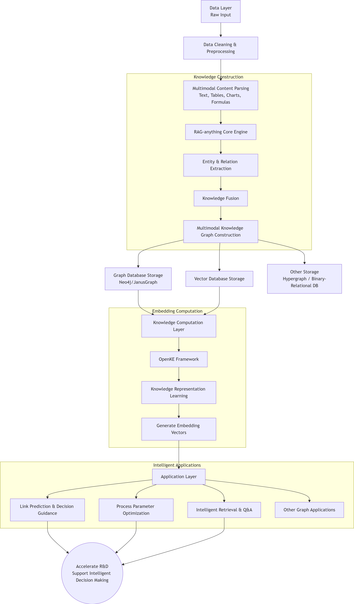
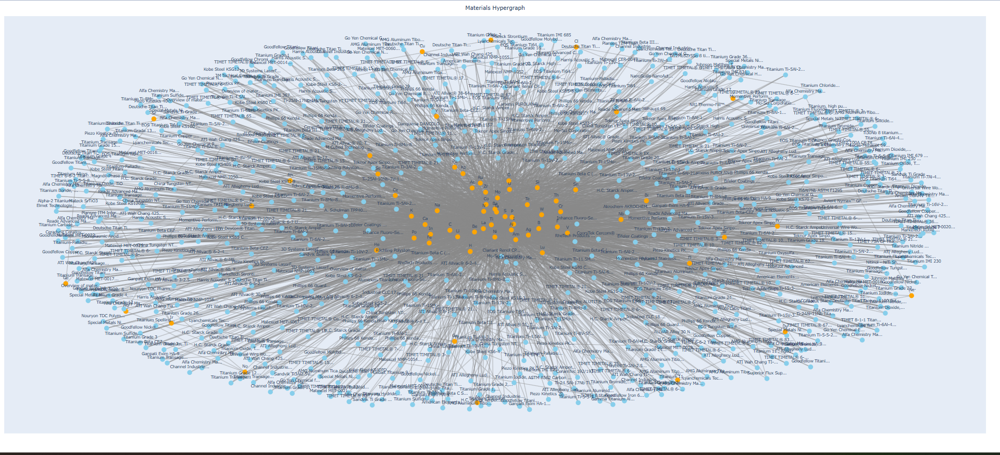
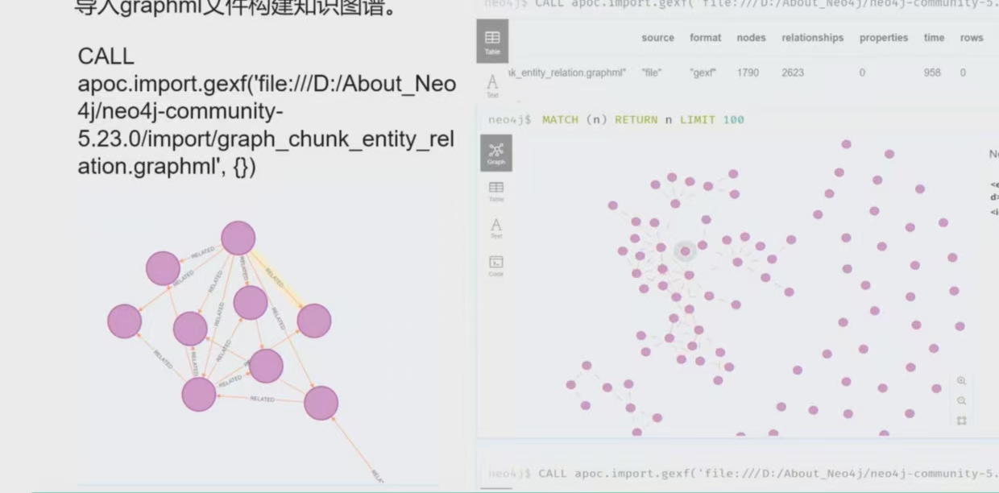
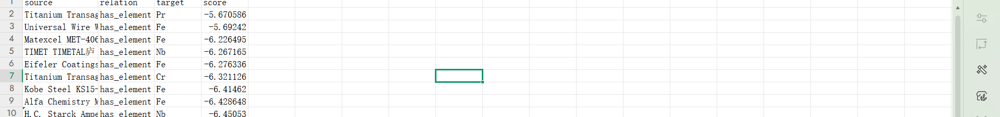

# Titanium Alloy Knowledge Graph

> A multimodal knowledge-graph construction pipeline for materials science: from PDFs and relational databases to hypergraph modeling, dual-tier storage, neuro-symbolic hybrid RAG, graph mining, and automated acceptance validation.

<p align="center">
  <strong>English</strong> | <a href="README_zh.md">中文</a>
</p>

[](https://www.python.org/)
[](https://neo4j.com/)
[](https://networkx.org/)
[](https://plotly.com/python/)
[](LICENSE)

---

## Table of Contents

- [Executive Summary](#executive-summary)
- [Motivation: Why Materials Knowledge Needs Hypergraphs](#motivation-why-materials-knowledge-needs-hypergraphs)
- [System Architecture](#system-architecture)
- [Key Technical Highlights](#key-technical-highlights)
  - [1. Hypergraph Modeling for Materials Science](#1-hypergraph-modeling-for-materials-science)
  - [2. Dual-Tier Storage Architecture](#2-dual-tier-storage-architecture)
  - [3. Neuro-Symbolic Hybrid RAG](#3-neuro-symbolic-hybrid-rag)
  - [4. Native TransE & OpenKE Integration](#4-native-transe--openke-integration)
  - [5. Automated Multi-Stage Validation](#5-automated-multi-stage-validation)
- [Visualizations & Database Integration](#visualizations--database-integration)
- [Quickstart & Reproducibility](#quickstart--reproducibility)
- [Project Structure](#project-structure)
- [Roadmap](#roadmap)
- [License](#license)

---

## Executive Summary

Titanium alloys (Ti-6Al-4V, TC4, TA15, and beyond) are core structural materials in aerospace, biomedical, and advanced manufacturing. Their behavior is governed by tightly coupled **composition–process–microstructure–property** relationships that involve multiple components and multiple phases. Conventional relational tables and binary knowledge graphs cannot faithfully represent such **N-ary relations** without loss.

This project implements a complete **materials hypergraph knowledge-graph pipeline**:

- Automatically extracts materials entities (alloy grades, elements, mechanical properties) and relations from **PDF literature** and **SQLite databases**;
- Models multi-component / multi-phase N-ary relations with a **hypergraph incidence graph**;
- Persists the graph in a **dual-tier storage** design (dependency-free SQLite / NetworkX local tier + optional Neo4j enterprise tier with vector indexing);
- Provides a **neuro-symbolic hybrid RAG** engine that fuses semantic, keyword, and topological retrieval;
- Ships a **pure-Python / NumPy TransE** knowledge-representation-learning implementation with OpenKE benchmark-format compatibility;
- Includes an **automated multi-stage validation** suite driven entirely by real pipeline artifacts.

The whole system can run end-to-end with **zero external services** (built-in mock-data fallback), while remaining upgradeable to optional enterprise components (Neo4j, sentence-transformers, external OpenKE).

---

## Motivation: Why Materials Knowledge Needs Hypergraphs

### The expressive bottleneck of binary graphs

The classic knowledge-graph representation is the directed triple `(head, relation, tail)`, e.g.:

```
(Ti-6Al-4V) --contains--> (Ti)
(Ti-6Al-4V) --contains--> (Al)
(Ti-6Al-4V) --contains--> (V)
```

This representation discards semantically critical information:

1. **Composition weights are lost** — Ti-6Al-4V is ~90% Ti, 6% Al, 4% V, but three identical `contains` edges cannot distinguish major elements from trace alloying additions;
2. **Multi-component synergy is flattened** — a given property is the result of a *combination* of conditions (e.g., "Ti-6Al-4V solution-treated at 950 °C + aged at 550 °C"), not of any single path;
3. **Multi-phase reactions are broken apart** — α+β duplex microstructures, grain-boundary α precipitation, and similar phenomena involve *several participants simultaneously*; binary triples force them into disconnected pairwise edges and destroy the overall semantics.

### How hypergraphs solve it

A hypergraph generalizes graph edges to **hyperedges** that connect any number of nodes. Multi-component / multi-phase reactions in materials synthesis are naturally N-ary:

```
hyperedge: [Ti-6Al-4V, Ti(90%), Al(6%), V(4%), solution 950°C, aging 550°C] --means--> duplex microstructure + high strength
```

For computational tractability and visualization, this project adopts a **hypergraph incidence graph** (a bipartite view): each hyperedge is itself modeled as a node, connected by ordinary edges to its member nodes. This preserves the N-ary semantics while remaining directly compatible with mature graph algorithms (PageRank, Louvain community detection, link prediction, etc.).

### Benefits for the materials domain

- **Query completeness** — answer questions such as "which alloys, under which process, simultaneously satisfy strength > 900 MPa and elongation > 10%?";
- **Knowledge discovery** — community detection reveals highly related alloy families that are not explicitly written in any single document;
- **Link prediction** — embedding-based similarity scores suggest missing alloy–property links, providing candidates for experimental design.

---

## System Architecture

<div align="center">
  
  <p><em>Figure 1: Full-lifecycle pipeline from multimodal ingestion to OpenKE-compatible embedding and hybrid RAG.</em></p>
</div>

The pipeline is orchestrated by `EnhancedAlloyKGSystem` (`main.py`) and consists of six stages:

```
                         ┌──────────────────────────────────────────────────┐
                         │            Inputs (config/paths.py)             │
                         │   data/sample/*.pdf     data/processed/materials.db │
                         └───────────────────┬──────────────────────────────┘
                                             │
                         ┌───────────────────▼──────────────────────────────┐
                         │  Stage 1: Data Preprocessing (script/data_loader.py) │
                         │  PDFProcessor: PyMuPDF page-level text/table/image │
                         │  DatabaseParser: read SQLite tables as an extra source │
                         │  ⚠ Falls back to built-in mock data if none exist │
                         └───────────────────┬──────────────────────────────┘
                                             │ processed/*_processed.json
                         ┌───────────────────▼──────────────────────────────┐
                         │  Stage 2: KG Construction (entity_relation_extractor.py) │
                         │  RuleBasedExtractorHG: alloy/element/property regex │
                         │  Optional neural extraction via Ollama CLI        │
                         │  → entities/relations → dedup → hypergraph build  │
                         └───────────────────┬──────────────────────────────┘
                                             │ entities_relations_hg_.json
                         ┌───────────────────▼──────────────────────────────┐
                         │  Dual-Tier Storage                               │
                         │  Local:  SQLite / NetworkX / JSON (zero deps)    │
                         │  Enterprise (optional): Neo4j 5.x vector index   │
                         └───────────────────┬──────────────────────────────┘
                                             │
                         ┌───────────────────▼──────────────────────────────┐
                         │  Stage 3: RAG System (enhanced_rag_system.py)    │
                         │  OfflineTextEncoder (no GPU required)            │
                         │  query(top_k=5, method='hybrid')                 │
                         │  = semantic + keyword + graph-topology fusion    │
                         └───────────────────┬──────────────────────────────┘
                                             │
                         ┌───────────────────▼──────────────────────────────┐
                         │  Stage 4: Graph Mining (advanced_graph_mining.py) │
                         │  PageRank / Louvain / cosine-similarity (>0.7)   │
                         │  link prediction / causal paths / entity clusters│
                         └───────────────────┬──────────────────────────────┘
                                             │
                         ┌───────────────────▼──────────────────────────────┐
                         │  Stages 5-6: Acceptance Tests + Final Report     │
                         │  (main.py / validation_system.py)                │
                         │  results/final_acceptance_report_*.json          │
                         └──────────────────────────────────────────────────┘
```

All paths are resolved from the project root by `config/paths.py` — no machine-specific absolute paths in source code.

---

## Key Technical Highlights

### 1. Hypergraph Modeling for Materials Science

The **N-ary hyperedge relation model** is the core differentiator of this project compared with ordinary knowledge-graph toolkits.

- `RuleBasedExtractorHG` (`script/entity_relation_extractor.py`) organizes extractions into hypergraph JSON (`{'nodes': {...}, 'edges': [...]}`); hyperedge nodes and their member nodes form an **incidence graph** that can be loaded into NetworkX directly for downstream graph algorithms;
- Domain-aware regex patterns cover common materials expressions:
  - Alloy grades: `Ti-6Al-4V`, `TC4`, `TA15`, `Grade 5`, `TNTZ`, etc.;
  - Element contents: `Ti 90%`, `Al content of 6%`, `6wt V`, etc.;
  - Mechanical properties: `tensile strength`, `yield strength`, `hardness`, `modulus`, etc.;
- Entity normalization (`normalize_entity`) handles common OCR confusions (`l/1`, `O/0`, `S/5`) and unifies aliases through whitelist mapping;
- A hypergraph cleaning pass runs after construction to remove isolated nodes and redundant edges, keeping the input quality high for downstream graph algorithms.

### 2. Dual-Tier Storage Architecture

The storage layer serves two usage profiles — "locally reproducible" and "enterprise scalable":

| Tier | Technology | Characteristics | Code |
|------|------------|-----------------|------|
| Local | SQLite + NetworkX + JSON | Zero external services; clone and run; unified `GraphDatabaseInterface` | `script/knowledge_storage_system.py` |
| Enterprise | Neo4j (5.x, vector index) | Graph traversal and vector retrieval; credentials injected via environment variables only | `script/neo4j_knowledge_storage.py`, `neo4j_hypergraph_generator.py` |

- **Security practice**: Neo4j connection settings are read exclusively from `NEO4J_URI / NEO4J_USER / NEO4J_PASSWORD` environment variables; the repository contains no real credentials, and `.env.example` provides a template;
- `KnowledgeQualityEvaluator` quantifies knowledge quality (completeness / consistency) before and after persistence;
- GraphML export (`db_to_graphml_generator.py`) allows importing the graph into external tools such as Gephi.

### 3. Neuro-Symbolic Hybrid RAG

`WorkingRAGSystem.query(question, top_k=5, method='hybrid')` implements a three-path retrieval fusion:

```
                    ┌────────────────────────────────────────────┐
   question ──────► │ semantic_retrieval  cosine similarity      │
                    │ keyword_retrieval   inverted-index match   │
                    │ graph_retrieval     topological subgraph   │
                    └────────────────────────────────────────────┘
                                   │ fusion (method='hybrid')
                                   ▼
                         top-k results + sources
```

- **Symbolic side**: `graph_retrieval` traverses the knowledge-graph topology and retains interpretable path evidence;
- **Neural side**: `OfflineTextEncoder` provides a dependency-free frequency-vector encoder (`vocab_size=1000`, `embedding_dim=128`, no GPU required); optionally, `sentence-transformers` can be installed to upgrade to semantic embeddings;
- Results from all three paths are fused under `top_k` (default 5), balancing semantic similarity with structural reachability.

### 4. Native TransE & OpenKE Integration

`EnhancedTransE` (`script/openke_integration.py`) is a **pure Python / NumPy** implementation of the TransE translation-distance model — no PyTorch required:

- Hyper-parameters: `embedding_dim=64`, `margin=1.0`, `learning_rate=0.01`, 1:1 negative sampling;
- Training: margin-based ranking loss (`max(0, margin + pos_score - neg_score)`) with per-triplet SGD updates of entity / relation embeddings;
- Compatibility: `data/openke_benchmark/` ships standard OpenKE benchmark files (`entity2id.txt / relation2id.txt / train2id.txt / valid2id.txt / test2id.txt`); `MultiSourceKGEmbedding` supports joint embedding over multiple knowledge sources;
- `quick_openke_test.py` probes whether an external OpenKE installation is available — all `openke.*` imports live inside try/except blocks, so the main flow degrades gracefully when OpenKE is not installed.

### 5. Automated Multi-Stage Validation

Two complementary, fully reproducible validation suites drive quality gates from real pipeline artifacts — no manual scoring:

**A. Fast validation — `run_validation.py` (`SystemValidator`)** covers five check categories (data processing, knowledge graph, RAG system, graph mining, system integration) on a 100-point scale.

**B. Full acceptance — `main.py` (`EnhancedAlloyKGSystem`, 6-stage pipeline)**

| Stage | What is verified |
|-------|------------------|
| 1. Data preprocessing | Multimodal parsing and cleaning artifacts |
| 2. KG construction | Graph files, node / edge scale, embedding artifacts |
| 3. RAG system | Retrieval implementation and query quality |
| 4. Graph mining | Mining implementation, method soundness, artifact quality |
| 5. Acceptance test cases | End-to-end assertions |
| 6. Final report | Aggregated output under `results/` |

In parallel, `validation_system.py` (`ValidationSystem`) provides a multi-dimensional scoring model (completeness, consistency, connectivity, informativeness, coverage). Every stage emits timestamped JSON reports to `results/` with per-item conclusions (PASS / PARTIAL / FAIL) and failure reasons, ready to be consumed by CI gates.

---

## Visualizations & Database Integration

<div align="center">
  
  <p><em>Figure 2: Force-directed visualization of the alloy–element incidence structure (hypergraph topology).</em></p>
</div>

<div align="center">
  
  <p><em>Figure 3: Neo4j schema definition, APOC graph batch import, and connected-subgraph queries in the enterprise tier.</em></p>
</div>

<div align="center">
  
  <p><em>Figure 4: Knowledge-representation-learning output and link-prediction score ranking.</em></p>
</div>

Interactive exploration is available through `visualize_hypergraph_plotly.py`, which renders the simplified knowledge graph (`data/sample/knowledge_graph_simplified.json`) as a Plotly force-directed view in the browser.

---

## Quickstart & Reproducibility

### Environment

- Python 3.9+
- Core dependencies in `requirements.txt` (7 lightweight packages: pandas, numpy, networkx, scikit-learn, PyMuPDF, plotly, tqdm)
- Optional dependencies in `requirements-optional.txt` (Neo4j, sentence-transformers, torch, requests; OpenKE is cloned from source — see the file for details)
- Works on Windows / Linux / macOS (paths are resolved uniformly by `config/paths.py`)

### Installation

```bash
git clone <your-repo-url>
cd titanium-alloy-knowledge-graph
python -m venv .venv
# Windows
.venv\Scripts\activate
# Linux / macOS
source .venv/bin/activate

pip install -r requirements.txt
# Optional: pip install -r requirements-optional.txt
```

### Run the full pipeline in minutes

The project ships a built-in mock fallback: with no PDF and no database, it auto-generates sample data, so the entire pipeline runs **without any external service**.

```bash
# 1. Full acceptance run (6 stages: preprocessing → KG → RAG → mining → tests → report)
python main.py

# 2. Fast validation (100-point scale)
python run_validation.py

# 3. Interactive visualization (opens in the browser)
python visualize_hypergraph_plotly.py

# 4. Optional: sanity-compile all entry points
python -m py_compile main.py run_validation.py validation_system.py script/*.py
```

### Optional extensions

```bash
# Dual-tier storage demo (local SQLite / NetworkX, no external services)
python run_knowledge_storage.py

# Database → GraphML export
python db_to_graphml_generator.py

# OpenKE availability probe (prints a hint if OpenKE is absent, never errors)
python quick_openke_test.py

# Neo4j hypergraph generation (requires .env NEO4J_* and the neo4j package)
python neo4j_hypergraph_generator.py
```

### Reproducibility & audit

Every run writes timestamped JSON reports into `results/` (e.g., `quick_validation_20260901_213659.json`, `final_acceptance_report_*.json`) with per-item scores and details — suitable for cross-version comparison and CI audit.

---

## Project Structure

```
titanium-alloy-knowledge-graph/
├── main.py                          # 6-stage end-to-end acceptance entry point
├── run_validation.py                # Fast validation entry (100-point scale)
├── validation_system.py             # Multi-dimensional scoring validation system
├── visualize_hypergraph_plotly.py   # Plotly interactive visualization
├── db_to_graphml_generator.py       # DB → GraphML export
├── neo4j_hypergraph_generator.py    # Neo4j hypergraph generation (optional)
├── quick_openke_test.py             # Optional OpenKE probe
├── run_knowledge_storage.py         # Dual-tier storage demo entry point
├── config/
│   ├── paths.py                     # All paths (resolved from project root)
│   └── __init__.py
├── script/
│   ├── data_loader.py               # PDF / DB parsing + mock fallback
│   ├── entity_relation_extractor.py # Rule + optional-LLM extraction, hypergraph build
│   ├── entity_relation_extractor_db.py
│   ├── knowledge_storage_system.py  # SQLite / NetworkX dual-tier storage
│   ├── neo4j_knowledge_storage.py   # Neo4j export (optional)
│   ├── rag_system.py                # RAG template
│   ├── enhanced_rag_system.py       # Hybrid retrieval RAG
│   ├── advanced_graph_mining.py     # Graph mining toolkit
│   ├── dynamic_qa_generator.py      # Dynamic QA generation
│   └── openke_integration.py        # Native TransE + OpenKE compatibility
├── data/
│   ├── sample/                      # Demo data (tracked)
│   ├── openke_benchmark/            # OpenKE benchmark format (tracked)
│   ├── processed/                   # Runtime artifacts (gitignored)
│   └── README.md                    # Data format & integration guide
├── docs/
│   ├── PIPELINE.md
│   ├── CHANGELOG.md
│   └── images/                      # architecture / hypergraph / neo4j / predictions
├── PROJECT_DOCUMENTATION.md         # Self-contained technical documentation (14 chapters, 21/21 source files)
├── results/                         # Runtime JSON reports (gitignored)
├── requirements.txt                 # Core lightweight dependencies
├── requirements-optional.txt        # Optional heavy dependencies
├── .env.example                     # Environment variable template
└── LICENSE                          # MIT
```

---

## Roadmap

- [ ] Validate graph scale and extraction precision against real PDF literature corpora;
- [ ] Fix `run_validation.py` assumptions about legacy project-structure entry points (Class-F checks);
- [ ] Include inline-table cell parsing in mock data to improve table-extraction coverage;
- [ ] Add end-to-end examples and comparison baselines for `sentence-transformers` semantic retrieval;
- [ ] Provide a Docker Compose one-click startup for the Neo4j vector index;
- [ ] Pin exact dependency versions and add a CI pipeline template (GitHub Actions);
- [ ] Add multilingual (Chinese / English) extraction evaluation sets with F1 metrics.

---

## License

This project is open-sourced under the [MIT License](LICENSE). Copyright © 2026 Titanium Alloy Knowledge Graph Project Contributors. Third-party dependencies (PyMuPDF, NetworkX, scikit-learn, Plotly, Neo4j, etc.) are governed by their respective licenses.
